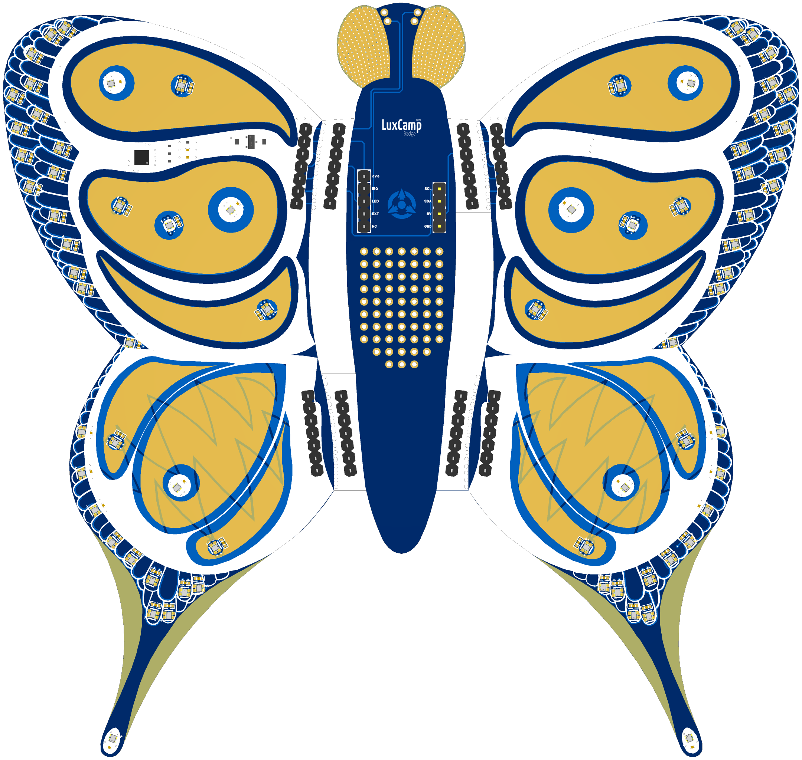

# LuxCamp Badge 2025

Badge for the LuxCamp 2025. It is a bring-your-own-microcontroller badge
with 72 WS2812 LEDs and a MPR121 capacitive touch sensor.

## Getting Started

The examples in this repository have been written with the
[M5Stack Atom Lite](https://shop.m5stack.com/products/atom-lite-esp32-development-kit)
or [M5Stack Atom S3 Lite](https://shop.m5stack.com/products/atoms3-lite-esp32s3-dev-kit)
microcontroller in mind. Check out the following examples in the `Software`
folder to get familiarized with the badge:

 - [Getting Started with MicroPython](Software/MicroPython/README.md)
 - [Getting Started with Arduino/PlatformIO](Software/CPP/HelloBadge)

## Render

